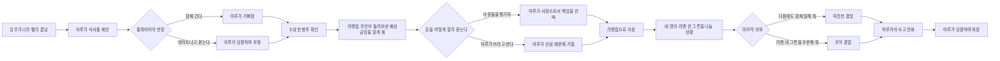

# VR 단편 시나리오 — 의뢰비는 라멘 한 그릇

## 작품 개요

- **시점:** 아비도스 사건이 끝난 뒤, 흥신소 68이 새로운 사무실을 알아보는 시기
- **플레이어:** 선생님
- **등장인물:** 아루 중심, 무츠키와 하루카는 전화 음성으로만 등장
- **예상 분량:** 8~12분
- **핵심 감정:** 허세 → 당황 → 진심 → 따뜻함 → 개그
- **VR 연출 목표:** 아루가 플레이어와 눈을 맞추고, 선택에 따라 가까이 다가오거나 시선을 피하며 표정이 바뀐다.

## 한 줄 이야기

임무를 예상보다 빨리 끝낸 아루는 선생님에게 완벽한 해결사의 모습을 보여주려 하지만, 돌려받은 라멘집 배상금과 굶고 있는 사원들 사이에서 고민하다가 결국 자신의 진짜 신념을 드러낸다.

## 이야기 흐름

## 장면 1. 끝나 버린 임무

**장소:** 해 질 무렵의 도심 골목  
**연출:** 아루는 처음에 플레이어와 거리를 두고 서 있다. 대사가 시작되면 시선 추적을 켠다.

| ID | 화자 | 대사 | 표정·연출 |
|---:|---|---|---|
| 0 | 내레이션 | 오늘은 아루와 단둘이 의뢰를 수행했다. | 기본 표정, Idle |
| 1 | 내레이션 | 그런데 준비한 시간보다 임무가 너무 빨리 끝나 버렸다. | 아루가 주변을 살핌 |
| 2 | 아루 | 후후, 봤지 선생님? 이것이 흥신소 68 사장의 완벽한 일 처리야. | 1 미소 |
| 3 | 아루 | 예상보다 일찍 끝났으니… 잠깐 시간 괜찮아? | 5 곤란, 잠시 시선 회피 |
| 4 | 아루 | 마침 내가 알아둔 식당이 있거든. 특별히 선생님도 데려가 줄게. | 1 미소 |

### 선택지 A

1. **“좋아. 같이 가자.”** → ID 5  
2. **“혹시 데이트 신청이야?”** → ID 6

| ID | 화자 | 대사 | 표정·연출 | 다음 |
|---:|---|---|---|---:|
| 5 | 아루 | 헤에~ 좋아! 역시 선생님은 이야기가 빠르다니까! | 2 활짝웃음, `Happy_Aru` | 8 |
| 6 | 아루 | 데, 데이트?! 그런 말은 한마디도 안 했거든! | 6 놀람, 플레이어 쪽으로 몸을 기울임 | 7 |
| 7 | 아루 | 어디까지나 유능한 동업자와의… 작전 회의야. 작전 회의! | 3 또 아루함, 시선 회피 | 8 |

## 장면 2. 검은 봉투

**연출:** 휴대전화 알림음이 울린다. 아루는 품 안에서 검은 봉투를 꺼낸 것처럼 손동작을 한다.

| ID | 화자 | 대사 | 표정·연출 |
|---:|---|---|---|
| 8 | 아루 | 그 전에 처리할 일이 하나 있어. 사실 오늘 현장에 이 봉투가 도착했어. | 4 무표정 |
| 9 | 아루 | 발신인은 시바세키 라멘집의 마스터. 내용물은… 내가 몰래 두고 왔던 배상금이야. | 5 곤란 |
| 10 | 내레이션 | 봉투에는 짧은 쪽지가 들어 있었다. ‘가게는 다시 열었으니 이 돈은 사원들과 함께 써라.’ | 아루가 아래를 바라봄 |
| 11 | 아루 | 민폐라니까, 정말. 악당이 두고 간 돈을 이렇게 돌려주면 체면이 안 서잖아. | 3 또 아루함 |
| 12 | 아루 | 게다가 이 돈이면 밀린 사무실 비용도, 사원들 식비도 해결할 수 있어. 하지만 배상금은 배상금이야. | 4 무표정 |

### 선택지 B

1. **“그럼 사원들을 먼저 챙겨 주자.”** → ID 13  
2. **“아루가 갖고 싶은 것에 써도 괜찮아.”** → ID 14

| ID | 화자 | 대사 | 표정·연출 | 다음 |
|---:|---|---|---|---:|
| 13 |     아루 | 역시 그렇게 생각하지? 사장이 부하를 굶길 수는 없으니까. | 1 미소, 플레이어와 눈을 맞춤 | 16 |
| 14 | 아루 | 나를 위해서? …고맙지만 그건 안 돼. | 6 놀람에서 1 미소로 전환 | 15 |
| 15 | 아루 | 마음대로 살더라도, 자기 때문에 생긴 일에는 책임지는 게 진짜 무법자니까. | 10 노려봄, 진지한 낮은 목소리 | 16 |
| 16 | 아루 | 좋아. 결정했어! 이 돈은 돌려드리고, 오늘 식사는 내 사비로 해결한다! | 2 활짝웃음 |
| 17 | 내레이션 | 그 순간 아루의 휴대전화가 울렸다. | 전화 진동음 |
| 18 | 무츠키(전화) | 아루쨩, 참고로 지금 회사 통장에는 라멘 한 그릇 값밖에 없어. | 공간감 없는 전화 음성 |
| 19 | 아루 | 무츠키?! 그걸 왜 지금 말하는 건데! | 6 놀람, 플레이어와 가까워졌다가 멈춤 |

## 장면 3. 사장님의 저녁 식사

**장소 전환:** 화면을 잠시 어둡게 하고 라멘 포장마차 또는 식당 앞 배경으로 전환한다.  
**연출:** 이동 중에는 발소리와 도심 환경음을 사용하고, 아루의 목소리가 플레이어의 진행 방향에서 들리게 한다.

| ID | 화자 | 대사 | 표정·연출 |
|---:|---|---|---|
| 20 | 내레이션 | 잠시 후, 우리는 다시 문을 연 시바세키 라멘집 앞에 도착했다. | 걷기 종료 후 Idle |
| 21 | 아루 | 걱정할 것 없어. 라멘은 원래 여러 사람이 나눠 먹을수록 작전 효율이 좋아지는 음식이야. | 3 또 아루함 |
| 22 | 내레이션 | 네 사람이 라멘 한 그릇을 나눠 먹는 장면을 상상하니 아무래도 작전 효율과는 관계가 없어 보였다. | 아루가 눈치를 봄 |
| 23 | 아루 | 왜, 왜 그런 눈으로 보는 거야? 하드보일드한 식사는 양보다 자세가 중요한 법이거든! | 5 곤란 |
| 24 | 아루 | 아무튼 선생님도 도와줬으니 보수는 받아야겠지. 원하는 걸 말해 봐. | 1 미소, 플레이어 정면 응시 |

### 선택지 C

1. **“다음에도 내 옆에서 함께 싸워 줘.”** → ID 25  
2. **“흥신소 직원들에게 라멘 네 그릇을 사 줘.”** → ID 27  
3. **“오늘 의뢰비는 라멘 한 그릇이면 충분해.”** → ID 29

### 분기 C-1. 진심

| ID | 화자 | 대사 | 표정·연출 | 다음 |
|---:|---|---|---|---:|
| 25 | 아루 | 그게 의뢰야? 정말 선생님답네. | 6 놀람에서 1 미소로 전환 | 26 |
| 26 | 아루 | 흥신소 68은 의뢰를 거절하지 않아. 특히 선생님의 의뢰라면 말이지. | 2 활짝웃음, 한 걸음 가까이 이동 | 31 |

### 분기 C-2. 사장의 책임

| ID | 화자 | 대사 | 표정·연출 | 다음 |
|---:|---|---|---|---:|
| 27 | 아루 | 네 그릇?! 그건 현재 예산의 정확히 네 배잖아! | 6 놀람 | 28 |
| 28 | 아루 | …하지만 맞는 말이야. 오늘만큼은 내가 어떻게든 해 볼게. 사장이니까. | 1 미소, 고개를 끄덕임 | 31 |

### 분기 C-3. 라멘 한 그릇

| ID | 화자 | 대사 | 표정·연출 | 다음 |
|---:|---|---|---|---:|
| 29 | 아루 | 라멘 한 그릇이면 충분하다니… 그 말, 어디서 많이 들어 본 것 같은데. | 8 장난 | 30 |
| 30 | 아루 | 좋아. 오늘 의뢰는 성공이야. 보수는 내가 확실하게 책임질게! | 2 활짝웃음, `Happy_Aru` | 31 |

## 장면 4. 역시 아루

| ID | 화자 | 대사 | 표정·연출 |
|---:|---|---|---|
| 31 | 내레이션 | 그때 전화기 너머로 다급한 하루카의 목소리와 함께 멀리서 폭발음이 들렸다. | 오른쪽 후방에서 작은 폭발음 |
| 32 | 하루카(전화) | 아루님! 말씀하신 대로 거래처에 확실하게 인사를 전했습니다! | 전화 음성 |
| 33 | 아루 | 자, 잠깐. 내가 말한 인사는 그런 의미가… 설마 또 폭탄을 쓴 건 아니지?! | 6 놀람 |
| 34 | 내레이션 | 전화기 너머로 두 번째 폭발음이 들렸다. | 더 큰 폭발음, 화면 약한 흔들림 |
| 35 | 아루 | 하루카아아아아! 선생님, 식사는 다음에! 이건 긴급 의뢰야! | 3 또 아루함, 급히 뒤를 봄 |
| 36 | 아루 | 아, 그리고… 오늘 함께해 줘서 고마워. 다음에는 진짜로 내가 살게! | 1 미소, 잠깐 눈을 맞춘 뒤 퇴장 |

## VR 상호작용 포인트

1. **시선 반응**  
   플레이어가 아루를 바라보면 대사를 이어가고, 일정 시간 다른 곳을 보면 “선생님, 듣고 있는 거지?”라는 짧은 보조 대사를 재생한다.

2. **거리 변화**  
   허세를 부릴 때는 거리를 유지한다. 당황할 때는 무의식적으로 가까워졌다가 물러나고, 마지막 진심을 말할 때는 천천히 한 걸음 다가온다.

3. **선택에 따른 표정 변화**  
   같은 결말로 합류하더라도 플레이어의 대답에 따라 놀람, 곤란, 미소, 활짝웃음이 다르게 이어진다.

4. **3D 사운드**  
   전화 음성은 아루의 손 위치에서, 폭발음은 플레이어 오른쪽 후방에서 들리게 해 자연스럽게 고개를 돌리도록 유도한다.

5. **입 모양과 음성**  
   아루의 일반 대사는 음성 재생 중 입 모양 애니메이션을 켜고, 내레이션과 전화 상대의 대사에서는 끈다.

## 기존 시스템에 연결하는 방법

- ID 0~4는 현재 `Toghter Aru.asset`의 도입부를 수정해 활용할 수 있다.
- 선택지의 `choiceIndex`는 각 분기의 첫 ID로 연결하고, 분기 마지막 항목의 `nextIndexOverride`로 공통 장면에 합류시킨다.
- ID 5와 30에서 `Happy_Aru.playable`을 재생한다.
- 얼굴 표정은 현재 프리셋 인덱스 0~10을 그대로 사용한다.
- 무츠키와 하루카는 모델 없이 전화 음성, 효과음, 자막만 사용하므로 현재 아루 모델만으로 제작 가능하다.

## 이 에피소드에서 보이는 아루의 매력

- 완벽한 해결사처럼 행동하지만 생활비와 식비 앞에서 무너지는 허당스러움
- 배상금을 다시 사용할 수 있어도 자신의 책임을 피하지 않는 선한 본성
- 사원들을 먼저 생각하는 서툰 사장으로서의 책임감
- 선생님의 선택에 따라 허세, 당황, 장난, 진심이 자연스럽게 드러나는 표정 변화
- 마지막 순간에는 멋진 말을 남기지만 곧바로 사고 수습을 위해 뛰어가는 아루다운 코미디
