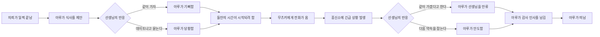

# VR 단편 시나리오 — 다음 약속은 의뢰가 아니야

## 작품 개요

- **시점:** 흥신소 68의 의뢰를 선생님과 아루가 함께 해결한 직후
- **플레이어:** 선생님
- **등장인물:** 아루 중심, 무츠키와 하루카는 전화 음성으로만 등장
- **예상 분량:** 5~7분
- **핵심 감정:** 허세 → 기대 → 설렘 → 불안 → 아쉬운 작별 → 다음 약속
- **VR 연출 목표:** 아루가 가까이 다가와 선생님과 시간을 보내려 하지만, 전화 한 통을 받고 떠나야 하는 상황을 눈맞춤과 거리 변화로 전달한다.

## 한 줄 이야기

의뢰가 일찍 끝난 뒤 아루는 선생님과 조금 더 함께 있고 싶어 식사를 제안하지만, 흥신소 68에 사고가 생겼다는 전화를 받고 아쉬움을 숨긴 채 떠난다.

## 이야기 흐름



## 장면 1. 예상보다 빠른 퇴근

**장소:** 해 질 무렵의 도심 골목  
**연출:** 아루는 선생님에게서 두세 걸음 떨어진 곳에 서 있다. 첫 대사가 시작되면 시선 추적을 켠다.

| ID | 화자 | 대사 | 표정·연출 |
|---:|---|---|---|
| 0 | 내레이션 | 오늘은 아루와 함께 의뢰를 수행했다. | 아루 Idle, 기본 표정 |
| 1 | 내레이션 | 예상보다 일이 빨리 끝나자, 아루는 만족스러운 표정으로 선생님을 바라보았다. | 아루가 플레이어를 바라봄 |
| 2 | 아루 | 후후, 어때 선생님? 흥신소 68 사장의 완벽한 일 처리였지? | 1 미소 |
| 3 | 아루 | 이 정도 의뢰라면 처음부터 나 혼자서도 충분했지만… 특별히 선생님에게 활약할 기회를 준 거야. | 3 또 아루함 |
| 4 | 아루 | 그런데 아직 시간이 꽤 남았네. 선생님, 오늘 다른 일정은 있어? | 5 곤란, 잠시 시선 회피 |
| 5 | 아루 | 없다면… 근처에서 저녁이라도 같이 먹지 않을래? 물론 이것도 작전 회의의 일부야. | 1 미소, 한 걸음 가까이 이동 |

### 선택지 A

1. **“좋아. 같이 가자.”** → ID 6  
2. **“그거 데이트 신청이야?”** → ID 7

| ID | 화자 | 대사 | 표정·연출 | 다음 |
|---:|---|---|---|---:|
| 6 | 아루 | 역시 선생님은 이야기가 빠르다니까! 내가 좋은 곳을 알아뒀어. | 2 활짝웃음, `Happy_Aru` | 9 |
| 7 | 아루 | 데, 데이트?! 그런 의미로 말한 게 아니거든! | 6 놀람, 상체를 뒤로 뺌 | 8 |
| 8 | 아루 | 유능한 동업자끼리 정보를 교환하는 자리야. 그러니까… 데이트와는 전혀 달라! | 3 또 아루함, 시선 회피 후 다시 눈맞춤 | 9 |

## 장면 2. 시작되기 전의 전화

**연출:** 아루가 식당 방향을 가리키려는 순간 휴대전화 진동음이 들린다. 아루는 처음에는 전화를 무시하려다가 반복되는 진동에 화면을 확인한다.

| ID | 화자 | 대사 | 표정·연출 |
|---:|---|---|---|
| 9 | 내레이션 | 아루가 골목 밖으로 걸음을 옮기려던 순간, 휴대전화가 짧게 울렸다. | 전화 진동음, Walking 직전 멈춤 |
| 10 | 아루 | 지금 중요한 작전 회의 중인데… 대체 누구야? | 4 무표정, 휴대전화를 확인하는 동작 |
| 11 | 아루 | 무츠키? 잠깐만, 선생님. 금방 끝낼게. | 1 미소에서 4 무표정으로 전환 |
| 12 | 무츠키(전화) | 아루쨩, 큰일 났어. 하루카가 새 사무실 후보를 정리하다가 건물 경보를 울려 버렸어. | 전화 음성, 아루의 머리 또는 손 위치에서 재생 |
| 13 | 아루 | 경보? 잠깐, 정리하다가 왜 경보가 울리는 건데? | 6 놀람 |
| 14 | 무츠키(전화) | 그게 말이지, 하루카가 “방해되는 벽을 치우겠습니다”라고 하더니 장비를 꺼냈거든. | 전화 음성, 뒤에서 작은 경보음 |
| 15 | 하루카(전화) | 아루님! 걱정하지 마십시오! 이번에는 폭발 범위를 정확하게 계산했습니다! | 전화 너머의 먼 음성 |
| 16 | 아루 | 이번에는?! 무츠키, 당장 하루카부터 멈춰! 내가 지금 갈게! | 6 놀람, 급히 몸을 돌림 |
| 17 | 내레이션 | 전화를 끊은 아루는 곧바로 뛰어가려다, 선생님이 곁에 있다는 것을 떠올리고 멈춰 섰다. | 두 걸음 후 멈추고 플레이어를 돌아봄 |

## 장면 3. 헤어져야 하는 순간

**연출:** 앞 장면의 급한 분위기에서 잠시 소리가 잦아든다. 아루는 선생님에게 다시 다가오지만 처음보다 약간 거리를 둔다.

| ID | 화자 | 대사 | 표정·연출 |
|---:|---|---|---|
| 18 | 아루 | 미안해, 선생님. 오늘 식사는 아무래도 다음으로 미뤄야 할 것 같아. | 5 곤란, 고개를 조금 숙임 |
| 19 | 아루 | 사장이 자리를 비운 사이에 회사가 사라지면 곤란하니까. | 3 또 아루함, 억지로 평정을 찾음 |
| 20 | 아루 | 별일 아닐 거야. 내가 가면 금방 해결할 수 있어. | 1 미소지만 눈맞춤을 오래 유지하지 못함 |

### 선택지 B

1. **“나도 같이 갈게.”** → ID 21  
2. **“그럼 다음 약속을 먼저 잡자.”** → ID 23

### 분기 B-1. 함께 가겠다는 선생님

| ID | 화자 | 대사 | 표정·연출 | 다음 |
|---:|---|---|---|---:|
| 21 | 아루 | 선생님까지 올 필요는 없어. 이건 흥신소 68의 사장인 내가 해결해야 할 일이야. | 4 무표정에서 10 진지한 표정 |
| 22 | 아루 | 그래도… 같이 가겠다고 말해 줘서 고마워. 그 말만으로 충분해. | 1 미소, 천천히 눈맞춤 | 25 |

### 분기 B-2. 다음 약속

| ID | 화자 | 대사 | 표정·연출 | 다음 |
|---:|---|---|---|---:|
| 23 | 아루 | 다음 약속? 그건 의뢰도 작전 회의도 아닌데? | 6 놀람 |
| 24 | 아루 | …좋아. 다음에는 방해받지 않을 장소로 내가 직접 정해 둘게. 기대해도 좋아. | 2 활짝웃음, 플레이어 쪽으로 한 걸음 접근 | 25 |

## 장면 4. 다음에는 반드시

| ID | 화자 | 대사 | 표정·연출 |
|---:|---|---|---|
| 25 | 아루 | 오늘은 여기서 헤어져야겠네. | 5 곤란, 잠깐 시선 회피 |
| 26 | 아루 | 하지만 약속은 약속이야. 흥신소 68의 사장은 한 번 한 약속을 절대 어기지 않으니까. | 1 미소, 정면 응시 |
| 27 | 아루 | 다음에는… 의뢰가 없어도 만나러 와 줘, 선생님. | 1 미소, 낮고 차분한 목소리 |
| 28 | 내레이션 | 아루는 몇 걸음 뛰어가다가 다시 뒤를 돌아보았다. | Walking 재생 후 정지, 뒤돌아봄 |
| 29 | 아루 | 그리고 오늘 함께해 줘서 고마워! 다음에는 내가 꼭 살게! | 2 활짝웃음, 손을 흔듦 |
| 30 | 내레이션 | 아루는 골목 너머로 달려갔다. 휴대전화 너머에서는 다시 무츠키의 웃음소리와 하루카의 다급한 목소리가 들렸다. | 아루 퇴장, 전화 음성이 멀어짐 |

## 연출 핵심

### 아루와 플레이어의 거리

- ID 0~4: 두세 걸음 거리. 아루가 사장다운 태도를 유지한다.
- ID 5~8: 식사를 제안하며 한 걸음 가까워진다.
- ID 9~17: 전화 때문에 몸이 플레이어에게서 멀어지는 방향으로 돌아간다.
- ID 18~20: 다시 플레이어를 향하지만 처음보다 약간 멀리 선다. 떠나야 한다는 감정을 거리로 보여 준다.
- ID 22 또는 24: 감사나 다음 약속을 말할 때 한 걸음 가까워진다.
- ID 28~30: Walking으로 퇴장하되, 마지막 한 번은 반드시 뒤돌아본다.

### 전화 음향

- 진동음은 아루의 머리 또는 손 근처에서 3D 재생한다.
- 무츠키와 하루카의 음성은 전화기 위치에서 재생하되, 일반 대사보다 좁고 얇게 들리도록 EQ 처리한다.
- 전화 중에도 아루의 입모양은 움직이지 않는다. 아루가 직접 말할 때만 입모양을 켠다.
- 마지막 전화 음성은 아루가 멀어지는 위치와 함께 감쇠시켜 퇴장을 자연스럽게 만든다.

### 표정 흐름

```text
기본 → 미소 → 활짝웃음/놀람 → 무표정 → 놀람 → 곤란 → 미소 → 활짝웃음
```

전화가 오기 전에는 기대와 설렘이 보이고, 전화 이후에는 책임감 때문에 감정을 숨기려는 흐름으로 잡는다.

## 현재 시스템 연결표

| 구간 | 설정 |
|---|---|
| ID 6 | `Happy_Aru.playable`, 표정 2, 입모양 켬 |
| ID 7 | 표정 6, 입모양 켬 |
| ID 12·14·15 | 전화 보이스 WAV, 아루 입모양 끔 |
| ID 16 | 표정 6, 아루 보이스 WAV, 입모양 켬 |
| ID 22 | 표정 1, 입모양 켬 |
| ID 24 | 표정 2, `Happy_Aru.playable`, 입모양 켬 |
| ID 27 | 표정 1, 보이스 음량을 조금 낮춤, 입모양 켬 |
| ID 28~30 | Walking → 뒤돌아보는 애니메이션 → 퇴장 |

## 선택지 연결

| 선택지 | `choiceIndex` | 분기 끝 `nextIndexOverride` |
|---|---:|---:|
| 같이 가자 | 6 | ID 6 → 9 |
| 데이트 신청이야? | 7 | ID 8 → 9 |
| 나도 같이 갈게 | 21 | ID 22 → 25 |
| 다음 약속을 먼저 잡자 | 23 | ID 24 → 25 |

## 이 버전의 핵심

이야기의 갈등을 돈이나 배상금 대신 **둘만의 시간이 시작되기 직전에 끊기는 상황**으로 단순화했다. 아루는 선생님과 더 있고 싶지만 사장으로서 책임을 외면하지 않는다. 마지막에는 “다음에는 의뢰가 없어도 만나러 와 달라”는 말로 두 사람의 관계가 업무 밖으로 한 걸음 나아갔음을 보여 준다.
